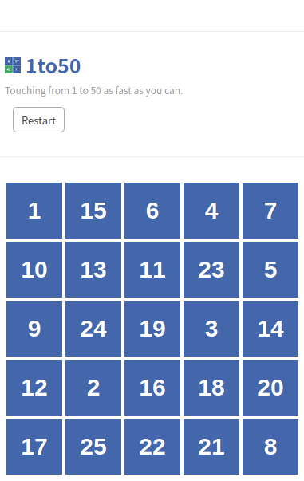

# 1-to-50-solver

The first screen is processed all at once and then clicked as fast as possible as the timer only starts after the first number is clicked. Then two threads are created, one for finding the numbers and one for clicking.

**NOTE: This is dependent on my particular screen resolution and arrangement, unlikely to work on your machine without modification.**